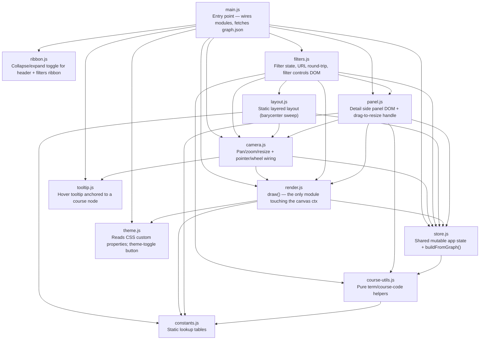

# JHU AMS Course Scraper

Scrapes JHU course listings — including prerequisites, restrictions,
corequisites, and full catalog descriptions — for Applied Mathematics &
Statistics, builds a SQLite database of how courses connect, and renders
that as a browsable, zoomable graph.

Three pieces:

- `fetch_courses.py` — scrapes one term into `data/<Year> <Season>/`
- `build_database.py` — reads all scraped terms and extracts prerequisite/
  exclusion relationships into `db/courses.db` and `docs/graph.json`
- `docs/index.html` — a static, dependency-free visualizer that fetches
  `graph.json` and renders it as a graph, published via GitHub Pages from
  `docs/`

It queries the Typesense search backend behind JHU's public course search
site (https://courses.jhu.edu), not the documented SIS API
(https://sis.jhu.edu/api) — that API never populates its `SectionDetails`
field (no prerequisites, restrictions, or catalog descriptions) and
requires a registered key. No API key or registration is needed here.

## Setup

```bash
pip install requests
```

## Scrape a term

```bash
python3 fetch_courses.py --term "Fall 2026"          # skip prompt
python3 fetch_courses.py                              # prompts, defaulting to the current term
python3 fetch_courses.py --term "Fall 2026" --yes      # skip overwrite confirmation
```

By default this fetches Applied Mathematics & Statistics courses. Override
any of the search parameters to scrape a different JHU department:

```bash
python3 fetch_courses.py \
  --school "Whiting School of Engineering" \
  --department "EN Applied Mathematics & Statistics" \
  --term "Fall 2026" \
  --out-dir "data/2026 Fall"
```

Output is written to `data/<Year> <Season>/` (e.g. `data/2026 Fall/`),
matching the term you queried — override with `--out-dir`:

- `courses.json` — raw section documents (one per section), including a
  nested `SectionDetails` object with `Prerequisites`, `Restrictions`,
  `CoRequisites`, and a full catalog `Description`
- `courses.csv` — flattened table (nested fields are JSON-encoded strings)

If either file already exists, you'll be asked to confirm before it's
overwritten. Pass `--yes`/`-y` to skip the prompt (e.g. in scripts).

Scraped terms already in the repo live under `data/` and are committed as a
historical record. The current term and the one after it are the exception:
a scheduled job keeps those two refreshed automatically (see "Automated
refresh" below); everything older is static and won't change unless you
rescrape it by hand.

## Automated refresh

A GitHub Actions workflow (`.github/workflows/refresh-courses.yml`) runs
`scripts/refresh_terms.py` weekly, re-scraping only the current term and
the one right after it, rebuilding the database, and pushing any resulting
changes. This is why a not-yet-published future term can already have a
`data/<Year> <Season>/` folder in the repo with zero courses in it — the
job will pick up real data automatically once JHU publishes that term.
Run it by hand with `python3 scripts/refresh_terms.py`, or trigger the
workflow manually from the Actions tab.

## Build the database

```bash
python3 build_database.py
```

Reads every `data/*/courses.json` and collapses per-term/per-section
records into one row per course, extracting:

- **Prerequisites** — parsed into an AND/OR tree, not flattened
- **Exclusions** — mutual-exclusion rules (JHU's `CoRequisites` field is,
  confusingly, always actually a "may not be taken concurrently with" rule
  in this data, never a true corequisite)

500-level, 800-level, and "Independent Academic Work" sections (JHU's label
for independent-study arrangements) are excluded — one-off student/faculty
arrangements, not real courses worth showing in the graph.

`EN.550.*` — the department's old numbering, from before it was renumbered
to `EN.553.*` — is remapped onto the still-live `EN.553.*` course of the
same number wherever one exists, recovering edges that a straight drop
would lose. Only references with no live counterpart (genuinely
discontinued courses), and any referenced course with no title at all (no
JHU catalog title and never scraped directly), are dropped from the
database entirely, not just hidden as stubs.

Many AMS courses are cross-listed as both a 4xy undergraduate number and a
6xy graduate number for the same course; `merge_grad_undergrad_pairs()`
combines each such pair into a single `EN.553.4xy/6xy` node so the merged
course shows the full prerequisites JHU sometimes records under only one
of the two numbers.

Writes two outputs, both fully reproducible by re-running the script:

- `db/courses.db` (SQLite, gitignored) — the queryable source of truth
- `docs/graph.json` (committed) — a nodes/edges export for the visualizer

Run this again after scraping a new term to pick it up.

## View the visualizer

```bash
python3 -m http.server
```

Then open http://localhost:8000/docs/ (needs `http://`, not a `file://`
open, since it fetches `graph.json`).

`docs/index.html` is a single self-contained file — no dependencies, no
build step. It lays out one column per course level (e.g. `EN.553.310`
sits in the "300s" column) and encodes relationship type in edge style
(solid+arrow = prerequisite, dashed = mutually exclusive). Pan, zoom, and
click a node for details.

This is also the published site, via GitHub Pages (`Settings → Pages →
Deploy from branch → /docs`).

## File map

`docs/index.html` is the HTML shell, `docs/css/*.css` are plain `<link>`
stylesheets (theme, base, header, graph, panel, loading), and
`docs/graph.json` is the committed build artifact the visualizer fetches.
The JS modules under `docs/js/` are native ES modules; the diagram below
shows who imports whom, rooted at `main.js` (the `<script type="module">`
entry point). Kept in sync with `docs/js/` — update whenever a module is
added, removed, or its imports change.


